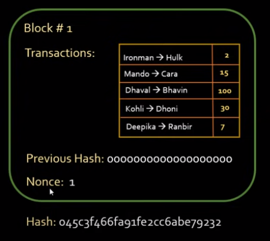

# Definitions 
## Ledger
-  A set of transactions

    

## BTC Ledger:
- All transactions that have ever happened since btc was invented.

## Blocks 
- The BTC Ledger needs to be stored in blocks as storing them in a continous memory location is not possible.

        

## Hash Functions

- Hash function coverts data of arbitrary length to a fixed length.

## Cryptographic hash functions
- Its impossible to guess the input based on the output.
 
   

# Explanation: 
### In the Blockchain the actual Block has not only the set of transactions, but it has additional components tied to it such as: Block Number, Previous Hash (Made from the protocol -> sha256), Nonce. The complete Block would look like this:

   

### The Bitcoin Protocol:
- The bitcoin protocol requires that the first few digits of the newly produced hash should be zero. Only the it is valid.

### How it works / Whats the goal? Mining...

- The bitcoin protocol converts the whole block into a string -> Adds a Nonce(Random number) -> supplies it to sha256 function -> See if the hash produced starts with the first 4 digits(Based on difficulty level) as a zero. How many digits should be zero is defined by the difficulty level: In this example the first 4 zeros. This whole process is repeated with a different Nonce everytime until we produce a hash that starts with first 4 digits as a zero. If you find a hash that has the first 4 digits as a zero. The block is verified. This whole process is called mining.

# Resources:

https://www.youtube.com/watch?v=ZhnJ1bkIWWk

### How do miners get their rewards
https://www.youtube.com/watch?v=QAsZgzLPaWU

### Visual / Interactive Tutorial
https://andersbrownworth.com/blockchain/blockchain